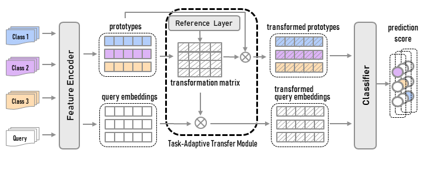

# TART: Improved Few-shot Text Classification Using Task-Adaptive Reference Transformation

This repository contains the code and data for our ACL 2023 paper:

[*TART: Improved Few-shot Text Classification Using Task-Adaptive Reference Transformation*](https://arxiv.org/pdf/2306.02175.pdf)

If you find this work useful and use it in your own research, please cite our paper.

`````
@article{lei2023tart,
  title={TART: Improved Few-shot Text Classification Using Task-Adaptive Reference Transformation},
  author={Lei, Shuo and Zhang, Xuchao and He, Jianfeng and Chen, Fanglan and Lu, Chang-Tien},
  journal={arXiv preprint arXiv:2306.02175},
  year={2023}
}
`````

### Overview
Meta-learning has emerged as a trending technique for tackling few-shot text classification and achieving state-of-the-art performance.
However, the performance of existing approaches heavily depends on the inter-class variance of the support set. As a result, it can perform well on tasks when the semantics of sampled classes are distinct while failing to differentiate classes with similar semantics.
In this paper, we propose a novel Task-Adaptive Reference Transformation (TART) network, aiming to enhance the generalization by transforming the class prototypes to per-class fixed reference points in task-adaptive metric spaces.
To further maximize divergence between transformed prototypes in task-adaptive metric spaces, TART introduces a discriminative reference regularization among transformed prototypes.
Extensive experiments are conducted on four benchmark datasets, and our method demonstrates clear superiority over the state-of-the-art models in all the datasets.

The figure gives an overview of our model.



### Data

We ran experiments on a total of 4 datasets. You may unzip our processed data file `data.zip` and put the data files under `data/` folder.

| Dataset | Notes |
|---|---|
| 20 Newsgroups ([link](http://qwone.com/~jason/20Newsgroups/ "20 Newsgroups")) | Processed data available. We used the `20news-18828` version, available at the link provided.
| Reuters-21578 ([link](https://kdd.ics.uci.edu/databases/reuters21578/reuters21578.html "Reuters")) | Processed data available. |
| Amazon reviews ([link](http://jmcauley.ucsd.edu/data/amazon/ "Amazon")) | We used a subset of the product review data. Processed data available. |
| HuffPost&nbsp;headlines&nbsp;([link](https://www.kaggle.com/rmisra/news-category-dataset "HuffPost")) | Processed data available. |

Please download pre-trained word embedding file `wiki.en.vec` from [here](https://dl.fbaipublicfiles.com/fasttext/vectors-wiki/wiki.en.vec) and put it under `pretrain_wordvec/` folder.

### Pre-trained_Weights

We released the pre-trained weights for each task. Feel free to download pre-trained weights via [google drive](https://drive.google.com/drive/folders/1w5lIv_Z9j5MTYQDHCHsJEPGWwsscqoWG?usp=sharing).

### Quickstart
After you have finished configuring the `data/` folder and the `pretrain_wordvec/` folder, you can run our model with the following commands. 
```
cd bin
sh tart.sh
```
You can also adjust the model by modifying the parameters in the `tart.sh` file.

### Dependencies
- Python 3.7.11
- PyTorch 1.11.0
- numpy 1.19.1
- torchtext 0.13.0
- termcolor 1.1.0
- tqdm 4.62.3
- CUDA 11.1

## Acknowledgement
The implementation is based on [MLADA](https://github.com/hccngu/MLADA). <br>
